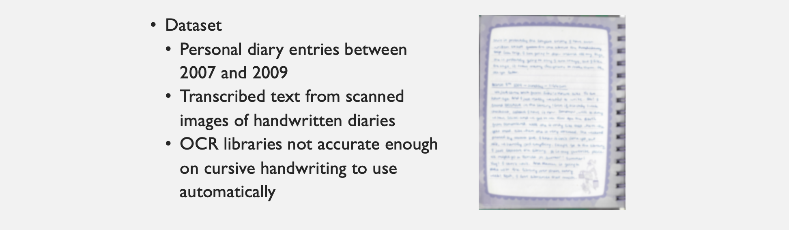
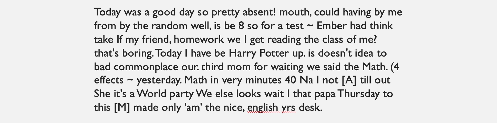
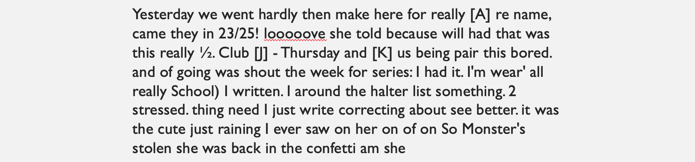
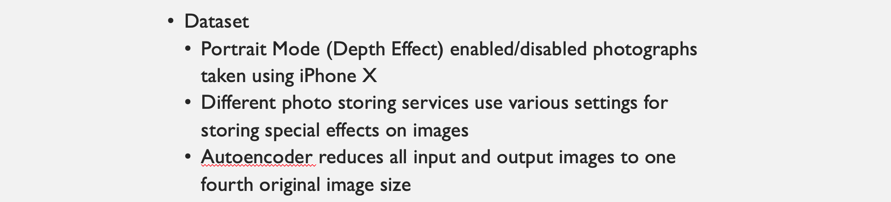
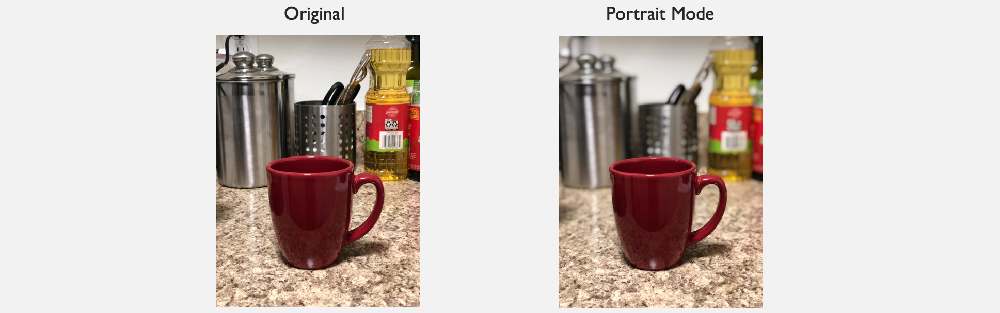
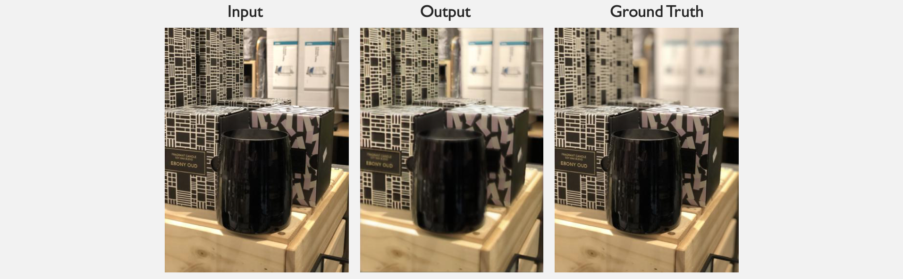
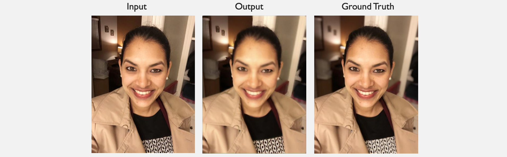

# CMPM202_Project2
Word RNN and Image Autoencoder

## Word RNN
For part 1, I compiled my own personal diary entries from 2007 to 2009, and generated some results using a word-based RNN. The results were interesting, generating some sentences that made partial sense. Given the small dataset size, the paragraphs were not always comprehensible. 

  
  
  
Some Results:



### How to run
Adapted from https://github.com/hunkim/word-rnn-tensorflow

To train
```bash
python train.py data/[folder_with_input.txt]
```

To sample from a trained model
```bash
python sample.py
```

## Image Autoencoder
For part 2, I wanted to create an autoencoder that could emulate 'portrait mode' on unseen images. The effect of creating a blur was successful, but my the photos in my dataset were not similar enough to create a differentiation between foreground and background. A reasonable next step would be add a module to separate the distant parts of the image from the foreground, and only apply the blur to the distant sections. A different improvement would be to incorporate two autoencoders - one to create a depth map, and one to apply the portrait mode effect. 



  
  
Some Results:

  

### How to run

To train
```bash
python train.py
[Replace appropriate data directories in utils.py]
```
To test
```bash
python test.py dataset/test/[path_to_test_image]
[Results will be placed in generated test_results folder]
```

Note: Some images from dataset have not been uploaded for subject privacy 
